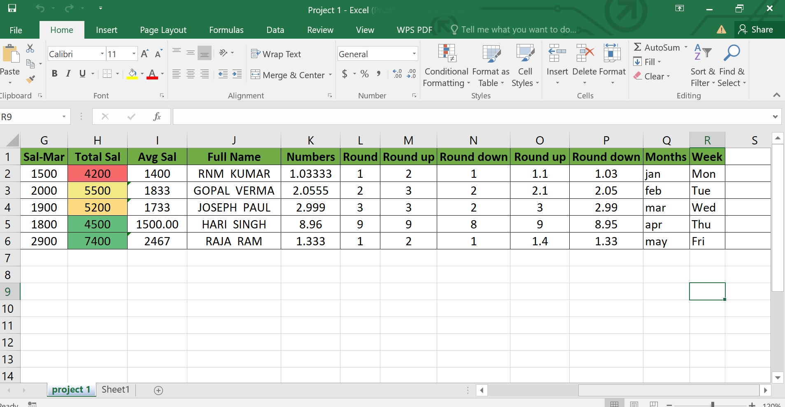

# O que é um Banco de Dados?

## Por que precisamos aprender Banco de Dados?

Hoje em dia, [praticamente tudo que fazemos gera dados](https://linkages.com.br/2023/03/29/dados-quantos-geramos-e-como-isso-impacta-nossa-vida/). A previsão é que em 2025 cada pessoa gere em torno de 5,3 GB de informações por dia mas, e o que é um dado? Dado é toda informação e conhecimento que temos sobre algo e todas essas informações são salvas em algum tipo de banco de dados porque a maioria dos dados precisa ser armazenados mas não podemos fazer isso de forma aleatória, geralemtne sao feitos em conjuntos que tem alguma lógica dentro de um contexto.

Redes Sociais, Sites de Busca, Contatos do nosso celular, tudo está em banco de dados.

Esses dados nos ajudam a tirar algumas conclusões e dessas conclusões conseguimos tomar várias ações, por isso ter esses dados e informações geram tanto poder pois podem ditar os caminhos que seu negocio irá seguir.

Se os Bancos de dados guardam tantas informações valiosas, imagina como deve ser para empresas ou governo perder um banco de dados? Seria um CAOS e por isso é tão importante saber trabalhar com banco de dados porque esse conhecimento vai ser um diferencial na sua carreira.

## o que é Banco de Dados?

É uma coleção organizada de dados que estão relacionados entre si de forma a criar algum sentido e possibilitar consultas a esses dados, ou seja, um banco de dados é uma coleção organizada de dados que são estruturados de forma que possam ser facilmente acessados, gerenciados e atualizados.

### Tá, mas o que isso quer dizer?

Porque guardar informações em Banco de dados ao invés de usar papel ou Excel? 

Sim, a gente poderia usar o Excel como um banco de dados mas com a quantidade de dados e informações que temos e a quantidade de pessoas que tem acesso a esses dados, é fácil a gente ter cenários como esses:

    
    

Além do que nós [temos mais dados do que podemos usar](https://exame.com/carreira/dados-uso-favor/amp/) e um Excel ou fichas de papel realmente "não dariam conta do recado" por ser um volume muito alto de informações.

Os bancos de dados se propõe a resolver esse problema de gerenciamento das informações através de:

- **Padronização de acesso**: Utiliza a mesma interface para todos os tipos de informação.
- **Segurança de acesso**: Determinar quem pode acessar os dados tornando as informações de acesso auditáveis.
- **Integridade das informações**: Impede através de regras que sejam salvos dados duplicados ou incorretos.
- **Escalabilidade**: Caso os dados estejam guardados em arquivos Word/Excel que possuem muitas linhas, teremos um sério problema de performance podendo gerar problemas com a manipulação desses dados. Já um Banco de dados permite trabalhar com milhares de linhas com a mesma performance de um banco com poucos dados.
- **Trabalho em equipe**: Em arquivos normais apenas uma pessoa pode editar por vez, já no banco de dados, várias pessoas conseguem editar ao mesmo tempo.

### E como um Banco de Dados consegue fazer tudo isso?

O Banco de dados possui 3 elementos principais:

- **Arquivos de Banco de Dados**: Assim como os demais arquivos da sua máquina, podemos visualizar através do explorer e são arquivos que suportam qualquer tipo de informação como textos, planilhas, imagens e etc.
- **Sistema Gerenciador de Banco de Dados (SGBD)**: São os sistemas que utilizamos para gerenciar os Bancos de Dados onde podemos visualizar as informações de maneira amigável em forma de tabelas que possuem colunas e linhas (como no Excel). As colunas identificam cada tipo de informação que queremos guardar, já as linhas guardam os dados de fato que populam o Banco de Dados.
- **Linguagem de Consulta**: São os comandos que usamos para interagir com o SGBD e trazer as informações que queremos consultar.

Uma das vantagens de saber mexer com Banco de Dados é que acessando as informações direto é mais fácil:
- Entender e resolver problemas relacionados à informação de forma muito mais rápida.
- Criar consultas e relatórios que vão te ajudar na tomada de decisão.
- Previnir problemas, conferindo se as informações foram salvas da forma correta.
