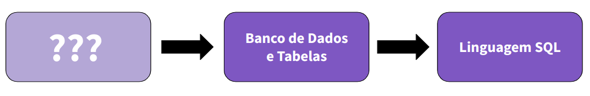
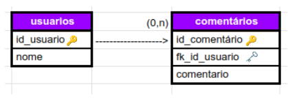

# Modelagem de Dados

Quando a gente começa a estudar sobre Banco de Dados, aprendems a usar SQL através dos SGBDs com o intuito de manupilar os dados e tabelas que, no geral, já estão prontos ou criamos através dos CRUDs.

Nesses casos, acabamos pulando uma etapa muito mportante que é anterior a isso tudo, a etapa de **Modelagem de Dados**.



Você já se perguntou qual foi a lógica usada pra criar aquele Banco de Dados? Por que as tabelas estão naquela estrutura? e as colunas? Por que tudo foi montado dessa forma?

É aí que entra a Modelagem de dados, pois é aqui que definimos quais serão as tabelas do Banco, quais informações irão conter e como serão feitas as relações entre esses dados levando em conta quais informações importantes que precisam ser armazenadas de acordo com o entendimento do problema e o levantamento de requisitos.

## Objetivo

O objetivo da Modelagem de Dados é **representar o mundo real com o máximo de precisão** para que tenhamos as informações certas armazenadas para ajudar na tomada de decisão.

Nós, como pessoas desenvolvedoras, temos que garantir que temos um bom entendimento do "mundo" e do problema que precisamos representar para mapear as informações e traduzir tudo da linguagem de negócios para termos tecnicos e não correr riscos de faltar dados nas análises posteoriores.

A modelagem de dados traz os seguintes benefícios:

- Reduz erros no desenvolvimento de softwares de banco de dados
- Facilita a velocidade e a eficiência da concepção e criação do banco de dados
- Cria consistência na documentação de dados e na concepção do sistema em toda a organização
- Facilita a comunicação entre engenheiros de dados e equipes de business intelligence

## Modelos de Dados

Um **Modelo de Dados** é uma descrição formal da estrutura de um Banco de Dados.

Pode ser dividido em 3 partes:
  - **Modelo Conceitual**: Representação visual dos conceitos do Banco de Dados, que nos dá mais clareza e entendimento dos requisitos do sistema representando de forma gráfica as entidades, atributos e relacionamentos.
  - **Modelo Lógico**: Representa a estrutura de do Banco de Dados na visão do usuário do SGBD, nesse momento as entidades, atributos e relações já estão em formato de tabela.
  - **Modelo Físico**: Usado pra projetar o esquema interno do Banco de Dados com a descrição das tabelas, colunas e relacionamentos e implemtando em um SGBD usando a linguagem SQL.

### Modelo Conceitual

É aqui que fazemos o primeiro desenho das nossas entidades e de quais dados iremos mapear.

Desenhamos diagramas onde estarão representados as entidades e seus atributos, aqui já podemos diferenciar o atributo identificador.

No exemplo abaixo, os retângulos são as as tabelas, as bolinhas são os tributos (a bolinha peeechida representa as chaves primárias e as vazias os demais atributos), o losango é o relacionamento e o valor entre parênteses representa a cardinalidade.

A cardinalidade é a forma de como os relacionamentos se dão.

Temos 3 tipos de cardinalidade: 
  - 1:1
  - 1:N
  - N:N

Quando temos m relacionamento N:N temos que criar uma tabela auxiliar ou associativa para representá-lo, ende ficarão registrados as chaves das tabelas originais


### Modelo Lógico

Aqui traduzimos o Modelo Conceitual em tabelas que vão armazenar as entidades e os atributos que desenhamos.

Cada linha/tupla da nossa tabela será um registro de um dado referente à essa entidade, esses dados não podem ser repetidos e a coluna com o atributo identificador costuma ser identificado com seu nome sublinhado.
Aqui já encontramos o conceito de chave estrangeira.



### Modelo Físico

Por fim, pegaremos tudo que foi planejado nos modelos conceitual e lógico e transformar em código SQL dentro de um SGBD para criar o Banco de Dados.


# Técnicas para Modelagem de Dados

## Diagramas de Entidade-Relacionamento

O diagrama de Entidade e Relacionamento (DER, ou ERD em inglês) te ajuda a identificar as relações entre os elementos de seu banco de dados e como a informação flui através de seu sistema ou processo empresarial, mostra como as entidades interagem.

Um DER permite que as pessoas desenvolvedores mapeiem cada elemento chave de um novo banco de dados. Permitindo a visualização de como o software funcionará, testar previamente certas relações e identificar quaisquer lacunas no software antes de ele entrar em funcionamento. Isto leva a um processo mais suave para a equipe de desenvolvimento quando as coisas entrarem em funcionamento.

A criação de um diagrama ER também ajuda a identificar áreas para melhoria em bancos de dados existentes.

Um diagrama ER facilita a visualização de onde o software atual precisa ser melhorado.

### Símbolos do diagrama de entidade e relacionamento
Cada diagrama pode usar uma série de símbolos de diagramas ER. Aqui estão alguns dos símbolos mais comuns:

- Retângulos: Os retângulos representam as entidades controladoras. Estas muitas vezes têm entidades fracas (retângulos duplos) que dependem delas.

- Oval: Os atributos são representados por formas ovais. Eles descrevem as características de uma entidade.

- Diamantes: Os diamantes são usados para mostrar as relações entre as entidades.

- Setas e linhas de conexão: Linhas e setas são usadas para mostrar quais entidades se relacionam umas com as outras.

- Cardinalidades: As cardinalidades descrevem quanta informação flui de um para o outro (mais sobre isso adiante).

### Benefícios de um diagrama de entidade e relacionamento

Dê uma olhada em alguns dos principais benefícios do uso de um diagrama de entidade e relacionamento.

1. Visualizar as relações
Um diagrama ER é um modelo físico das relações entre as entidades. Ele permite visualizar como as entidades se relacionam entre si, como funcionam seus relacionamentos e onde estes relacionamentos podem ser melhorados.

2. Simplificar sistemas complexos
Destrinche sistemas complexos e bancos de dados com um diagrama ER. Veja como as entidades interligadas se conectam e se sobrepõem para entender melhor como o sistema funciona.

3. Educar funcionários e stakeholders
Use um modelo de dados lógico (como um diagrama ER) para mostrar aos funcionários novos e existentes como seus sistemas funcionam. Use-o para atualizar stakeholders internos e externos e manter todos na mesma página.

4. Fácil de criar
Os diagramas de entidade e relacionamento são simples, o que significa que são fáceis de entender. Você não precisa ser um desenvolvedor de software para criar o diagrama, nem precisa de nenhum conhecimento técnico para entendê-lo. E com um espaço de trabalho virtual como a Miro, você pode usar um modelo pronto para começar mais rápido.


## Normalização de dados

Normalização de dados é um processo no qual atributos de dados em um modelos de dados são organizados para aumentar a coesão dos tipos de entidade. Em outras palavras, o objetivo da normalização de dados é reduzir e até eliminar redundância de dados, uma questão importante para pessoas desenvolvedoras, pois é incrivelmente difícil armazenar objetos em um banco de dados relacional que mantém a mesma informação em vários lugares.

```
O processo de normalização compreende o uso de um conjunto de regras, chamados de formas normais. Ao analisarmos o banco de dados e verificarmos que ele respeita as regras da primeira forma normal, então podemos dizer que o banco está na “primeira forma normal”. Caso o banco respeite as primeiras três regras, então ele está na “terceira forma normal”. Mesmo existindo mais conjuntos de regras para outros níveis de normalização, a terceira forma normal é considerada o nível mínimo necessário para grande parte das aplicações. [Microsoft 2007]

```
### Formas Normais

São um conjuntos de regras para adequar e simplificar as tabelas dos bancos de dados.

Diz-se que a tabela do banco de dados relacional está numa certa forma normal quando satisfaz as condições exigentes.

Cada forma normal segue requisitos da forma anterior, ou seja, se mantém uma herança de requisitos, com exceção da primeira forma que não possui uma antecessora.

- **Primeira Forma Normal (ou 1FN)**: Nesta forma os atributos precisam ser atômicos, o que significa que as tabelas não podem ter valores repetidos e nem atributos possuindo mais de um valor. 
  - **Exemplo**: CLIENTE = {ID + ENDEREÇO + TELEFONES}. Porém, uma pessoa poderá ter mais de um número de telefone, sendo assim o atributo "TELEFONES" é multivalorado. Para normalizar, é necessário: Identificar a chave primária e também a coluna que possui dados repetidos (nesse exemplo "TELEFONES") e removê-los, construir uma outra tabela com o atributo em questão, no caso "TELEFONES". Mas não se esquecendo de fazer uma relação entre as duas tabelas: CLIENTE = {ID + ENDEREÇO} e TELEFONE (nova tabela) = {CLIENTE_ID (chave estrangeira) + TELEFONE}.
- **Segunda Forma Normal (ou 2FN)**: Primeiramente, para estar na 2FN é preciso estar também na 1FN. 2FN define que os atributos normais, ou seja, os não chave, devem depender unicamente da chave primária da tabela. Assim como as colunas da tabela que não são dependentes dessa chave devem ser removidas da tabela principal e cria-se uma nova tabela utilizando esses dados.
  - **Exemplo**: PROFESSOR_CURSO = {ID_PROF + ID_CURSO + SALARIO + DESCRICAO_CURSO} Como podemos observar, o atributo "DESCRICAO_CURSO" não depende unicamente da chave primária "ID_PROF", mas sim somente da chave "ID_CURSO". Para normalizar, é necessário: Identificar os dados não dependentes da chave primária (nesse exemplo "DESCRICAO_CURSO") e removê-los, construir uma nova tabela com os dados em questão: PROFESSOR_CURSO = {ID_PROF + ID_CURSO + SALARIO} e CURSOS (nova tabela) = {ID_CURSO + DESCRICAO_CURSO}.
- **Terceira Forma Normal (ou 3FN)**: Assim como para estar na 2FN é preciso estar na 1FN, para estar na 3FN é preciso estar também na 2FN. 3FN define que todos os atributos dessa tabela devem ser funcionalmente independentes uns dos outros, ao mesmo tempo que devem ser dependentes exclusivamente da chave primária da tabela. 3FN foi projetada para melhorar o desempenho de processamento dos banco de dados e minimizar os custos de armazenamento.
  - **Exemplo**: FUNCIONARIO = {ID + NOME + VALOR_SALARIO + VALOR_FGTS}. Como sabemos o valor do FGTS é proporcional ao salário, logo o atributo normal "VALOR_FGTS" é dependente do também atributo normal "VALOR_SALARIO". Para normalizar, é necessário: Identificar os dados dependentes de outros (nesse exemplo "VALOR_FGTS") e Removê-los da tabela. Esses atributos poderiam ser definitivamente excluídos -- e deixando para a camada de negócio a responsabilidade pelo seu cálculo -- ou até ser movidos para uma nova tabela e referenciar a principal ("FUNCIONARIO").

## Desnormalização de bancos de dados

Desnormalização é uma técnica aplicada a bancos de dados relacionais com o objetivo de otimizar a performance de consultas que envolvem muitas tabelas. Esse tipo de consulta normalmente requer a utilização de junções (JOINS) entre tabelas para obter todos os dados necessários, o que acaba comprometendo o desempenho do banco de dados.

Para contornar esse problema em casos específicos pode ser viável desnormalizar o banco, juntando os dados em uma única tabela (ou menos tabelas do que as que eram usadas originalmente). Apesar de isso acabar gerando redundância de informações, as aplicações serão beneficiadas com o ganho de desempenho devido a não ser mais necessário unir várias tabelas.

## Ferramentas de Modelagem de Dados

[10 principais ferramentas de modelagem de dados](https://www.linkedin.com/pulse/10-principais-ferramentas-de-modelagem-dados-para-conhecer-asakura/)