# Origem dos Banco de Dados

## ⌛Década de 40

Segundo a História da Computação, os primeiro computadores surgiram entre 1945/1946 e eram apenas de uso militar e e universitário.

	
	
	
	

### **Tá… Mas nessa época, como os dados eram guardados?**

## ⌛Década de 50

Antigamente a única maneira possível de guardar informações eram usando fichas de papel. 📝

É uma forma bem arcaica porém ainda vemos alguns lugares ainda usando, ou seja:

- Preenche uma ficha de papel
- Coloca em uma pasta
- Guarda em um armário/gaveteiro

E assim começa a idéia de armzenar os dados.

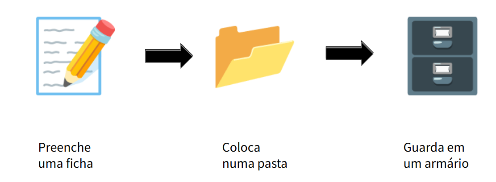

A partir dessa imagem, começamos a ver algumas teorias de Bancos de dados e seguindo essa linha de raciocínio vemos que em TI, temos outros nomes para esse elementos:

- Ficha   --> Registro
- Pasta   --> Tabela
- Armário --> Arquivo

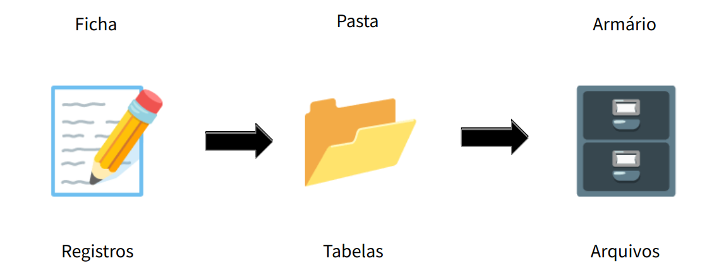

## ⌛Década de 60

Devido a todo o armazenamento dessas informações, gerou um grande acúmulo de papel e isso se tornou um grande desafio pois precisavam dispor de muito espaço.

Em paralelo a tudo isso, os computadores, que antes eram gigantescos, começaram a reduzir e ganhar espaço dentro das empresase a partir daí desafio passou a ser digitalizar todos esses dados.

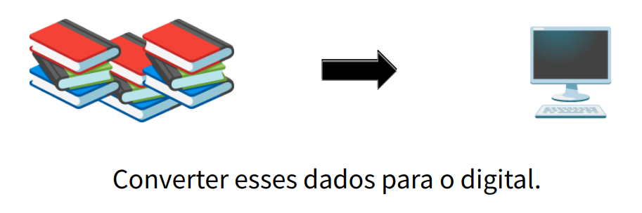

### Arquivos Sequenciais

Essa digitalização era feita de forma bem arcaica, cada ficha era colocada uma atrás da outra em um arquivo sequencial.

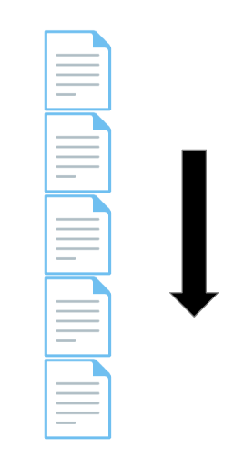

Como esses arquivos eram guardados em fitas magnéticas ou cartões perfurados não tinha outra forma de ler senão de forma sequencial porque essa era a caracteristica principal desses meios de armazenamento.

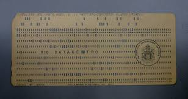

Cartões perfurados

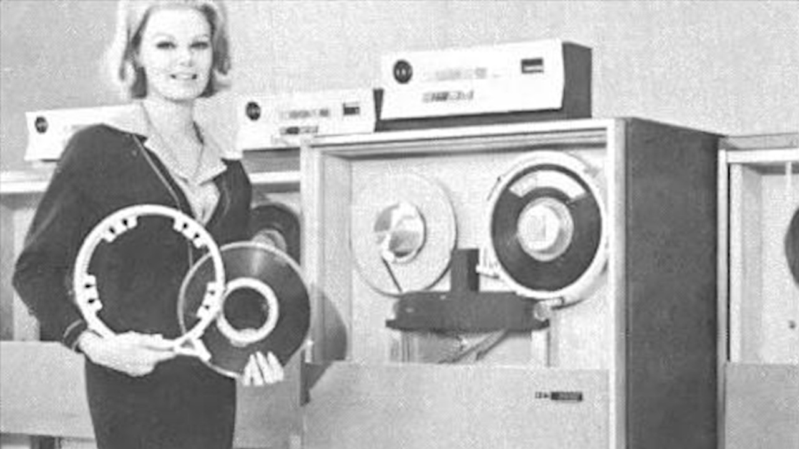

Fitas magnéticas

Ou seja, para ler o quinto cartão perfurado, tinha que ler todos os anteriores ate chegar no desejado.

Para ler uma fita magnética é da mesma forma, tem quer rebobinar e ir lendo ate chegar onde se quer.

E assim eram com as fichas, tinha que varrer todo os registros até encontrar o que queria e por conta dessa caracteristica ganhou esse nome de Arquivos Sequenciais.

Essa busca sequencial trazia muita lentidão mas apesar de tudo ainda era melhor que as fichas de papel.

### Discos de Armazenamento

Começaram a ser usados disquetes ou Winchesters (HDs antigos), esses tipos de mecanismos armazenam dados de maneira direta e não sequencial, dava acessar o dado em qualquer posição sem precisar sempre ir para o início dele.

	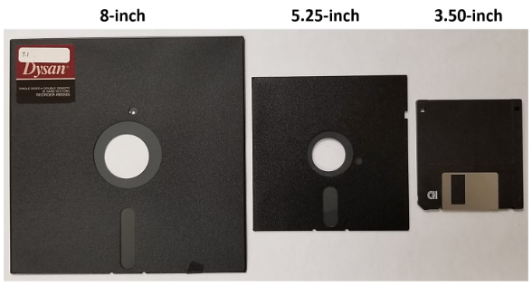
	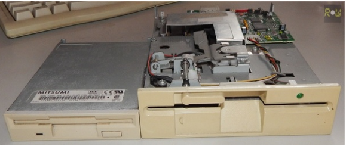
	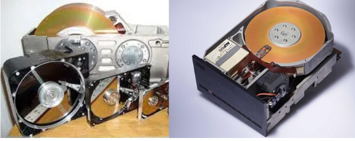

Nesses discos, os registros eram guardados numa espécie de tabela com índices numerados que serviam como chaves identificadoras de cada registro.
Por conta dessa forma de armazenamento direto e dos índices, ficava facil indexar a busca e ficava muito mais fácil e rápido localizar os registros.
Ganharam o nome de **Arquivos de Acesso Direto** justamente por essa caracteristica.

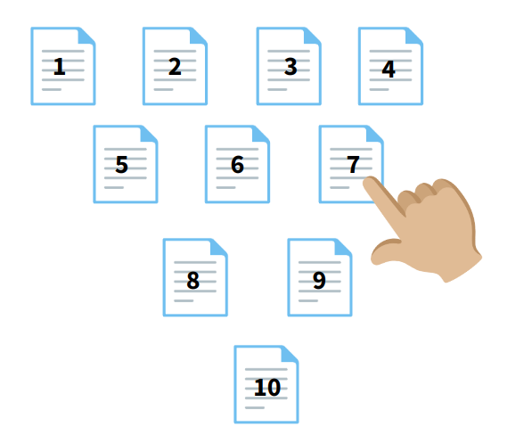

### Codasyl

Apesar dos arquivos de acesso direto serem muito melhores do que os arquivos sequenciais, nós ainda tínhamos problemas com os índices que eram bem simples.

Então ainda na década de 60, o Departamento de Defesa dos EUA tinha como tarefa achar uma maneira mais segura e inteligente de armazenar dados.

Com isso, iniciaram-se várias Pesquisas Militares que foram muito importantes e valiosas pra história e nessa missão criou-se um evento chamado **Codasyl**, que foi um grande encontro entre militares, empresas e universidades para discutir várias tecnologias emergentes e novas coisas a serem criadas e daí surgiu o **COBOL** que se tornou uma das linguagens mais valiosas da história.

O Cobol foi a primeira linguagem a se preocupar efetivamente com a lógica de programação e com os dados embedados nela, ou seja, a estrutura de dados era essencial para o Cobol e por isso ainda é usado por grandes empresas até hoje.

Programadores Cobol são raros e extremamente valiosos porque não existem versões novas de Cobol, ou seja, quem sabe, sabe porque não teve evolução, ou seja só tem como fazer migração ou atualização desses sistemas.

Também no Codasyl, foi discutido a criação de uma nova tecnologia, que ganhou o nome de Banco de Dados.

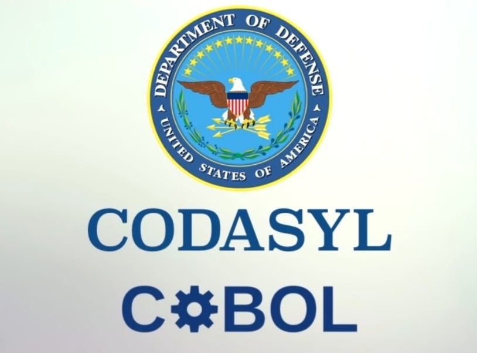

### Banco de dados

Os Bancos de dados contém: 
- **Base de dados**: São os próprios dados, as informações armazenadas no banco de dados.
- **Sistema de Gerenciamento**: SGBD (Sistema de gerenciamento de Banco de Dados) ou DMS (Datbase Management System, em inglês), é o sistema que gerencia os dados dentro do ecossistema do banco de dados.
- **Linguagem de Consulta**: Diferente da linguagem de programação, não precisa saber várias linguagens para acessar os dados, segunda o Codasyl, só é necessário aprender uma única linguagem de acesso aos dados e é ela que vamos usar para dar os comandos e comunicar com o banco de dados.
- **Usuarios**: Pessoas/Aplicações que possuem acesso e interagem com o Banco de Dados.
- **Modelo de dados**: Define a estrutura dos dados e como eles estão organizados no banco de dados.

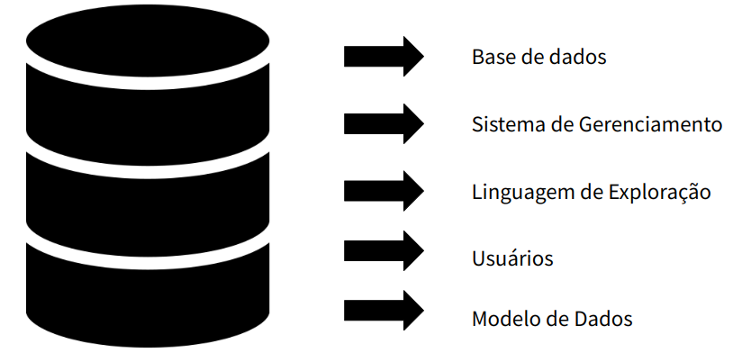

Lá no Codasyl, teve uma empresa muito importante nesse processo, a IBM.

A IBM é umas das maiores empresas de tecnologia do mundo e foi muito importante em todos esses estudos junto com o departamento de defesa dos EUA. Ajudou na construção e evolução dos bancos de dados.

Um de seus fundadores foi Herman Hollerith, principal impulsionador do leitor de cartões perfurados, principal forma de entrada de informação nos computadores da época,  também construiu o primeiro PC (computador mecânico) e construiu muito mais coisa.

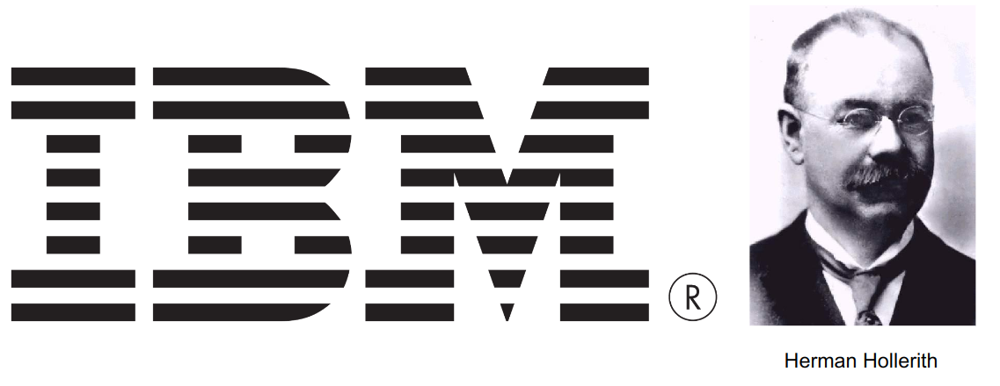

Uma das primeiras propostas da IBM foi a criação de dados hierárquicos, onde os dados armazenados teriam uma hierarquia e esses dados seriam interligados de maneira simples que ficou conhecido como Modelo Hierárquico.

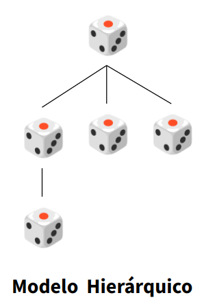

Em seguida, teve a proposta de outro modelo que era uma evolução do hierárquico, o Modelo em Rede.
No modelo em rede, não tinha níveis, nenhum era superior ou inferior, eles se utilizavam de uma Rede Inteligente para se interligar.

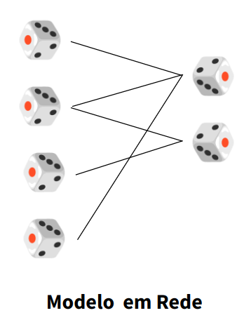

Esse dois modelos surgiram no meio da década de 60, e foram bem importantes mas não são utilizados hoje em dia.

Esses modelos permitiam guardar vários tipos de dados de maneira simples. Porém eles dificultavam muito o relacionamento entre esses dados.

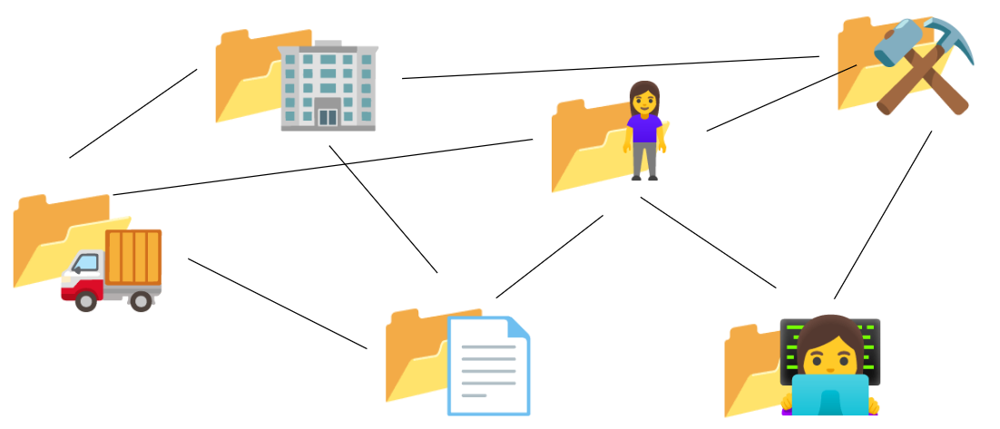

## ⌛Década de 70

O pesquisador da IBM Edgar F. Codd inciou diversos estudos e começou a ver que os dados poderiam ter relações entre si e com isso seria possivel também ter relações entre as tabelas dando assim origem a um novo modelo chamado ** **, que é o modelo que iremos usar aqui no curso.

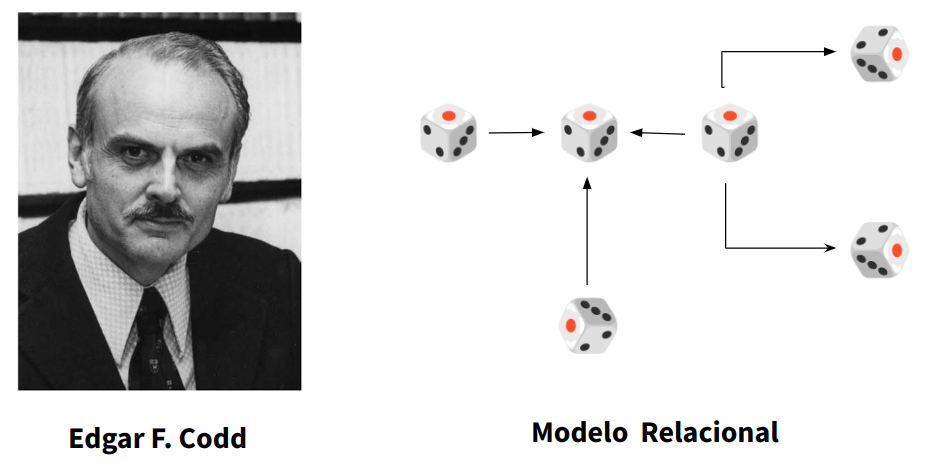

No modelo relacional, quando temos o cadastro de uma cliente guardado no banco de dados, conseguimos acesso a todos os dados dessa cliente, mas até aí qualquer modelo também permite.

Mas com o Modelo relacional, com esses dados, podemos saber onde ela mora e suas compras. Tendo essa informação, podemos saber a data da compra, estoque e até o fornecedor.

Em resumo, a partir de um único dado conseguimos várias outras informações verificando as tabelas desde que tenham algum tipo de relacionamento e que esse relacionamento seja especificado no momento da construção desse banco.

Esse acesso aos relacionamentos podem ser feitos através da linguagem de consulta que já falamos anteriormente.

### Linguagem SQL

O primeiro nome dessa linguagem foi "**S**tructured **E**nglish **Que**ry **L**anguage" (**SEQUEL**). Sua abreviação seria uma brincadeira com a sonoridade das palavras "Seek Well" (em português, Buscar Bem).

Mas logo o nome mudou para "**S**tructured **Q**uery **L**anguage", que abreviado é **SQL** como nós conhecemos.

A linguagem SQL é uma linguagem de consulta onde através de comandos damos instruções ao Banco de Dados e através dessas solicitações (**Querys**) obter respostas.

A princípio a idéia era que a linguagem SQL fosse universal, ou seja, qualquer banco de dados a entenderia e apesar de ter comandos quer são entendidos por todos, algumas empresas fabricantes foram criando seus prórpios comandos que são entendidos somente por aqueles Bancos de Dados, como se fossem dialetos da própria linguagem SQL como o **Transact-SQL** da Microsoft e o **PL-SQL** da Oracle e com isso gerando uma despadronização.

Nesse momento, órgãos como **ANSI** e **ISO** entraram em campo para "consertar a bagunça" e assim surgiram os padrões como o **ANSI-SQL** que tornaram a Linguagem SQL universal novamente.

Houve o surgimento de vários bancos de dados como Oracle, IBM, dBase e SQL Sever porém eram soluções pagas e corporativas.

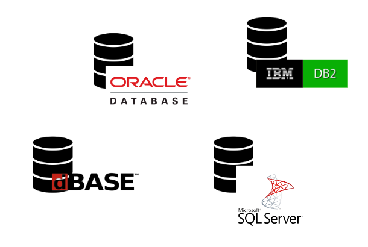

Mas também surgiram soluções gratuitas como MySQL, MariaDB, FireBird e PostgreSQL

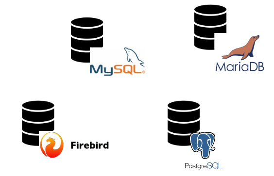