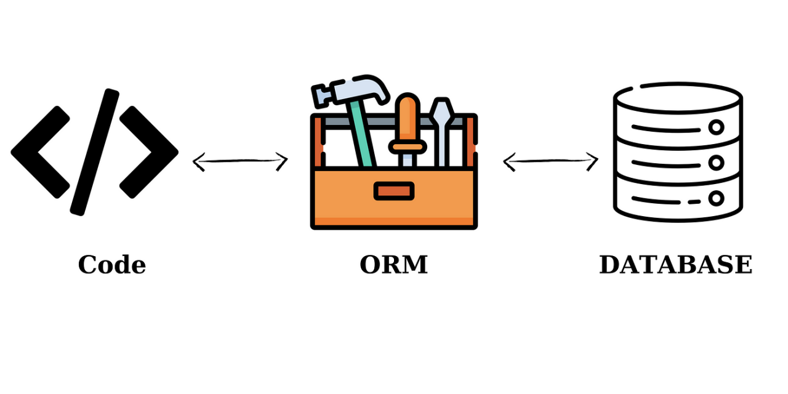
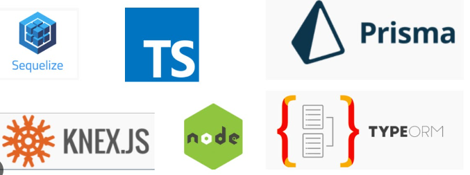

# O que são ORMs?

Com a popularização das linguagens orientadas a objetos, viu-se que levávamos muito tempo fazendos querys SQL, ou seja, a gente desenvolvia a aplicação e pra consultar dados tinhamos que escrever as querys na mão e isso era muito custoso e levava muito tempo.

Com isso, foi gerada uma forma da gente abstrair e no lugar de escrever tudo, deixamos que o ORM se encarregue desse trabalho e faça essa buscas por nós nos poupando esse tempo de desenvolvimento.

ORM significa Mapeamento de um Objeto Relacional (Object-Relational Mapping, em inglês). Todas as tabelas do Banco de Dado serão representadas através de classes e os registros serão representados por instâncias que ja são mais próximos de quem está acostumado com o paradigma de orientação á objetos, ficando assim muito mas fácil de lidar pois só precismos nos preocpar com a linguagem de programação que estamos usando e caso a gente precise de alguma informação do banco de Dados, o ORM já abstrai essa camada pra gente.

Existem vários tipos de ORM para cada linguagem de programação, para NodeJS/TypeScript temos esses abaixo que são os mais populares, porém aqui vamos focar no TypeORM.

