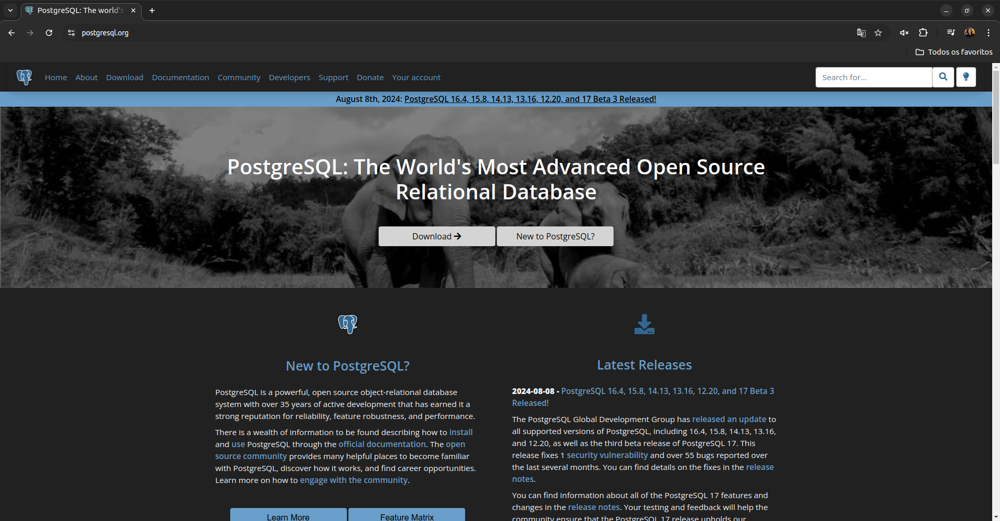

# PostgreSQL

É um SGBD que surgiu do projeto **Ingres** na Universidade de Berkeley e foi criado pela equipe liderada pelo Michael Stonebraker.

É conhecido como **Postgres** ou **PostgreSQL** e sua primeira versão nesse formato foi lançada em 1997.

Desenvolvido em **Linguagem C** e de **código aberto** (*open-source*), está disponivel em todos os Sistemas Operacionais.

[Site oficial](https://www.postgresql.org)

Por ser um Banco de Dados transacional, é compatível com as **propriedades ACID** (**Atomicidade, Consistência, Isolamento, Durabilidade**).

Suporta Views, Views Materializadas, Procedimentos, Triggers e outros tipos de objetos comuns a Bancos de Dados Relacionais.

É mantido por um grupo internacional formado por diversas empresas e contribuidores individuais conhecidos como PostgreSQL Global Development Group.

## Características Princiapis

- Compativel com ACID
- Banco Transacional
- Suporta Particionamento
- Possui Controle de Versão
- Busca texto completo
- Indexação com vários tipos de algoritmos
- Permite operações de manutenção em modo online
- Operações geoespaciais (PostGIS)
- Possui linguagem Procedural

## Conectividade

Usa redes TCP/IP padrão, através do protocolo de transmissão **libpq** utilizando uma instância de apenas uma única porta. Uma vez conectado, a comunicação é feite diretamente via comandos. 

Está de acordo com o padrão ANSI e SQL99 porém também possui alguns comandos específicos.

## Limites

| Item                           |Valor     |
|--------------------------------|----------|
|Tamanho máximo do banco de dados|ilimitado |
|Tamanho máximo da tabela        |32GB      |
|Tamanho máximo da linha         |1,6TB     |
|Tamanho máximo de campos        |1GB       |
|Nº máximo de linhas por tabela  |ilimitado |
|Nº máximo de colunas por tabela |250 - 1600|
|Nº máximo de índices por tabela |ilimitado |

## Terminologia

Por ter sido criado em ambiente universitário, usa muitos termos acadêmicos e baseados em álgebra relacional.

- Nomes de objetos comuns em Bancos de dados:

| Termo Comum   |Termo Postgres                          |
|---------------|----------------------------------------|
|Tabela         |Relação                                 |
|Linha          |Tupla                                   |
|Coluna         |Atributo                                |
|Bloco de dados |Página (quando o bloco esta em disco)   |
|Página         |Buffer (quando o bloco está em memória) |

## Quem usa PostgreSQL?

- Reddit
- Sony Online Games
- Skype
- Instagram
- Disqus
- Yandex Mail
- Trip Advisor
- ISS
- BASF
