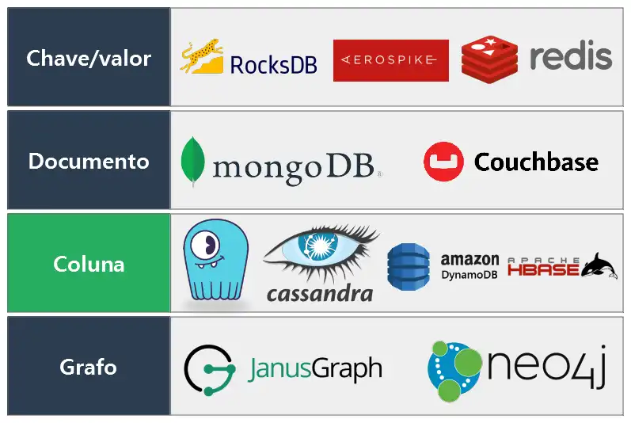

# Tipos de Banco de Dados

O Tipo do Banco de dados é definido no momento da modelagem  do banco de dados e pendando na forma de armazenar esses dados.

## NoSQL - Não relacionais

No geral, armazenam dados em formato de documentos e priorizam a flexibilidade, esacalabilidade e rapidez nas repostas às consultas com isso sua performance é melhor.

Essa estutura de documentos são menos comuns a quem não está acostumado com programação pois não possuem um esquema de dados e por isso um Banco de Dados Não Relacional funciona melhor para armazenar dados flexíveis em forma ou tamanho, ou que possam mudar no futuro.

Geralmente então em formato JSON que é um documento de texto que armazena os dados de acordo com uma hierarquia de chave/valor mas também podem se apresentar em outreos formatos como, por exemplo, o XML.

## SQL - Relacionais

SQL é a [4ª linguagem mais utilizada no mundo](https://survey.stackoverflow.co/2023/#section-most-popular-technologies-programming-scripting-and-markup-languages) e a maioria das grandes empresas utilizam, ou seja, é uma linguagem extremamente popular.

Utilizam tabelas para armazenamento dos dados, priorizam características como **Atomicidade, consistência, isolamento e durabilidade** (**ACID**) da informação, ou seja, consegue manter a integridade dos dados apesar de erros ou interrupções no seu processamento, o que pode custar bastante em performance porém isso pode ser otimizado utilizando índices e estruturas de tabela e consultas.

Isso significa que um conjunto de operações consequentes sempre será concluído em conjunto. Se uma única operação falhar, todo o conjunto de operações falhará. Isso garante a precisão dos dados em todos os momentos.

Bancos de dados relacionais são a melhor opção quando seus dados são previsíveis em termos de tamanho, estrutura e frequência de acesso. 

Geralmente estamos mais familizarizados com a estrutura de tabelas por serem estruturas que costumamos utilizar de várias formas no dia-a-dia.

As colunas contém os atributos dos dados eas linhas contém os registros dos valores que queremos aramzenar.

Os Bancos de Dados relacionais possibilitam o relacionamento entre as tabelas para que trazer uma visão mais generalizada sobre os dados e facilitar a tomada de decisão e gerar valor com as informações.

Cada tabela possui uma **Chave Primária** (**Primary Key**) que identifica a tabela de maneira única e ela é usada como **Chave Estrangeira** (**Foreign Key**) para estabelecer o relcionamento entre as tabelas, possibilitando a comunicaçãi entre as tabelas e facilitando o resgate dos daods podendo utilizar apenas uma unica consulta parar pegar dados de ambas as tabelas.