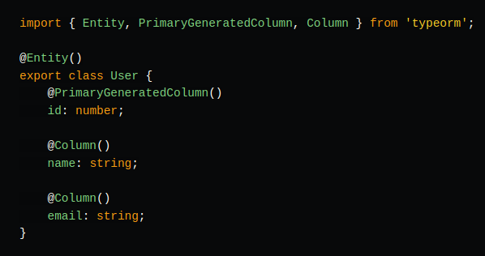
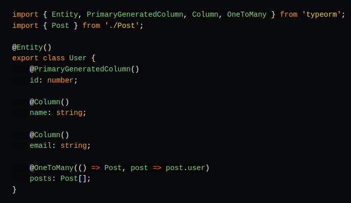
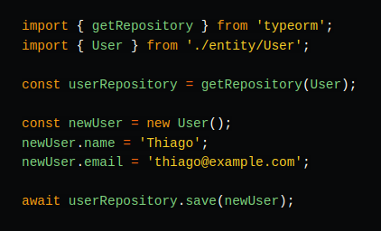
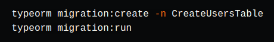

# O que é TypeORM?

O TypeORM usa o paradigma Orientado à Objetos para se comunicar com o Banco de Dados.

Ele é escrito e TypeScript e foi projetado paraser usado com Node.JS.

O TypeORM suporta os principais bancos de dados: **postgres, mysql, mariadb, postgres, cockroachdb, sqlite, mssql, oracle, sap, spanner, cordova, nativescript, react-native, expo, mongodb**

Com TypeORM, você pode definir entidades e relacionamentos diretamente no seu código TypeScript, permitindo uma integração perfeita entre a lógica da aplicação e o banco de dados. Ele também oferece suporte a migrações de banco de dados, permitindo que você mantenha o esquema do banco de dados sincronizado com o código da sua aplicação.

## Principais Funcionalidades do TypeORM

### Entidades

No TypeORM, você define as entidades usando classes TypeScript. Aqui está um exemplo de uma entidade chamada User:

### Relacionamanetos

O TypeORM suporta todos os tipos de relacionamentos comuns: One-to-One, One-to-Many, Many-to-One e Many-to-Many. 

### Repositórios e Gerenciamento de Dados

Com TypeORM, você pode usar repositórios para gerenciar suas entidades. Aqui está um exemplo de como criar um novo usuário:

### Migrações

TypeORM também oferece suporte a migrações, permitindo que você gerencie alterações no esquema do banco de dados de forma controlada:

## Dicas para Aproveitar o Máximo do TypeORM
### Use TypeScript:
O TypeORM foi feito para ser usado com TypeScript, então aproveite ao máximo os benefícios de tipagem estática e autocompletar.

### Entenda os Decorators:
Os decorators são uma parte essencial do TypeORM. Familiarize-se com eles para definir suas entidades e relacionamentos de forma eficiente.

### Mantenha suas Migrações Organizadas:
Use migrações para gerenciar alterações no esquema do banco de dados, especialmente em projetos maiores e em produção.

### Explore a Documentação:
A [documentação do TypeORM](https://typeorm.io/) é extensa e bem detalhada. Consulte-a sempre que tiver dúvidas ou precisar de informações adicionais.
